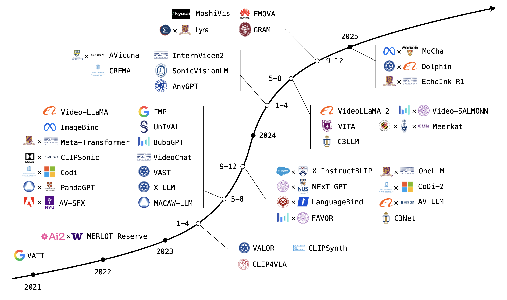
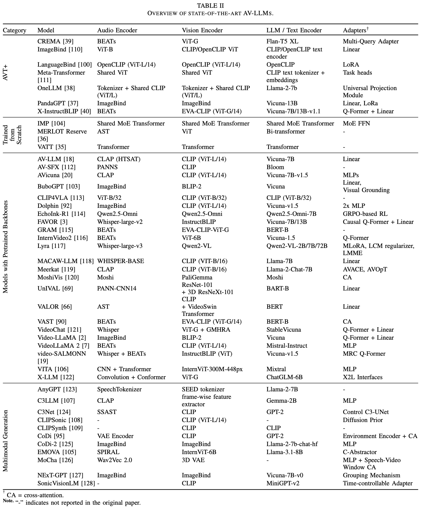
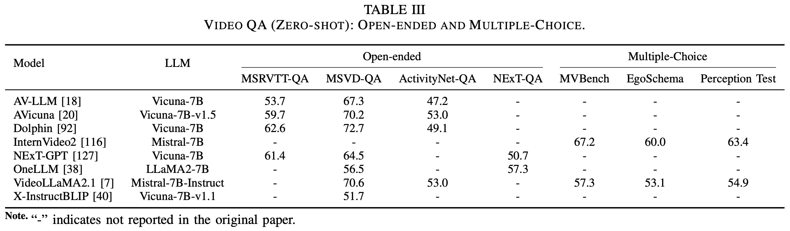
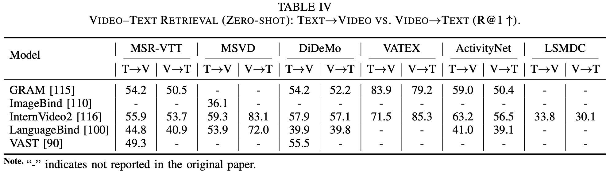
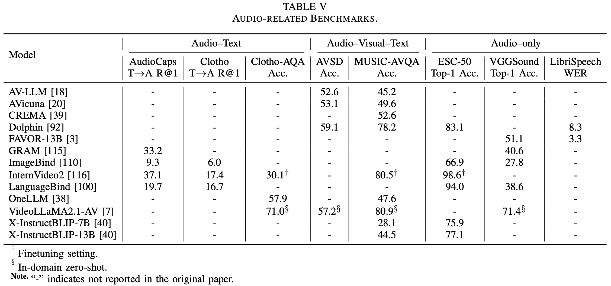
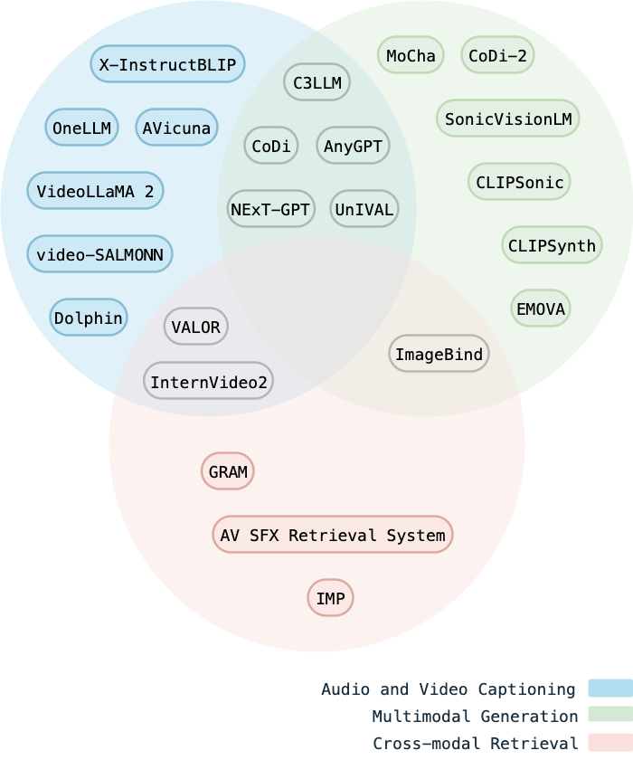

# A Survey on Audio-Visual Large Language Models (AV-LLMs)

> Official repository for the paper: **“A Survey on Audio-Visual Large Language Models”**  
> Wenyi Yao, Roksana Yahyaabadi, Hossein Hassani, and Soodeh Nikan

[Paper](./paper/Survey.pdf) · [Datasets CSV](./dataset.md) · [Model List](./data/models.csv)

[](figures/AV-LLMs.pdf)

---

## ✨ Highlights
- **First dedicated survey on AV-LLMs.** We position AV-LLMs as a distinct research line beyond VLMs.  
- **Unified taxonomy.** We categorize by **modality scope**, **backbone origin**, and **generation objective**.  
- **Datasets crosswalk.** A task→dataset mapping for image–text, video–text, audio–text, and audio–video–text.  
- **Architecture & training.** Encoders, adapters/Q-Formers, alignment objectives, instruction tuning.  
- **Applications.** Audio/Video captioning, multimodal dialogue, cross-modal retrieval.  
- **Challenges & Outlook.** hallucination, social biases, computational cost.

---

## Table of Contents

1. [Model Taxonomy](#1-model-taxonomy)  
2. [Datasets](#2-datasets)
3. [Performance Evaluation](#3-performance-evaluation)
4. [Applications](#4-applications)
5. [How to Cite](#5-how-to-cite) 

---

## 1. Model Taxonomy


---

## 2. Datasets
| **Task**                  | **Dataset**                                                                                     | **Year** | **Modalities**                      | **Data Scale**                                       |
| ------------------------- | ----------------------------------------------------------------------------------------------- | -------: | ----------------------------------- | ---------------------------------------------------- |
| **Image–Text**            | [SBU](https://www.cs.rice.edu/~vo9/sbucaptions/)                                                |     2011 | Image, Text                         | 1M images with captions                              |
|                           | [COCO](http://cocodataset.org/)                                                                 |     2014 | Image, Text                         | 330K images, 5 captions each                         |
|                           | [Visual Genome (VG)](http://visualgenome.org/)                                                  |     2017 | Image, Text                         | 108K images, dense annotations                       |
|                           | [CC3M](https://dataset.csail.mit.edu/cc3m/)                                                     |     2018 | Image, Text                         | 3M images with captions                              |
|                           | [CC12M](https://github.com/google-research-datasets/cc12m)                                      |     2021 | Image, Text                         | 12M images with captions                             |
|                           | [LAION-400M](https://laion.ai/blog/laion-400-open-dataset/)                                     |     2021 | Image, Text                         | 400M image–text pairs                                |
|                           | [LAION-2B](https://laion.ai/blog/large-openclip/)                                               |     2021 | Image, Text                         | 2B image–text pairs                                  |
|                           | [LAION-COCO](https://laion.ai/blog/laion-coco/)                                                 |     2022 | Image, Text                         | ~600M generated captions for web images (COCO-style) |
| **VQA**                   | [VQAv2](https://visualqa.org/)                                                                  |     2017 | Image, Text                         | 265K images, 1.1M QA pairs                           |
|                           | [GQA](https://cs.stanford.edu/people/dorarad/gqa/)                                              |     2019 | Image, Text                         | 113K images, 22M QA pairs                            |
|                           | [OCR-VQA–200K](https://ocr-vqa.github.io)                                                       |     2019 | Image, Text                         | ~1M QA pairs for OCR                                 |
| **Visual Grounding**      | [RefCOCO](https://github.com/lichengunc/refer)                                                  |     2014 | Image, Text                         | 142K referring expressions                           |
|                           | [RefCOCO+](https://github.com/lichengunc/refer)                                                 |     2014 | Image, Text                         | 141K referring expressions                           |
|                           | [RefCOCOg](https://github.com/lichengunc/refer)                                                 |     2016 | Image, Text                         | 104K referring expressions                           |
| **Video–Text**            | [Charades](https://allenai.org/plato/charades)                                                  |     2016 | Video, Text                         | 9.8K videos, 80K+ action labels                      |
|                           | [How2](http://how2dataset.org/)                                                                 |     2018 | Video, Audio, Text                  | ~2K hours instructional videos                       |
|                           | [HowTo100M](https://www.di.ens.fr/willow/research/howto100m/)                                   |     2019 | Video, Text                         | 136M video clips                                     |
|                           | [AVSD](https://video-dialog.com)                                                                |     2019 | Video, Audio, Text                  | 11K dialogues from 1.8K videos                       |
|                           | [WebVid-2.5M (a.k.a. WebVid-2M)](https://www.robots.ox.ac.uk/~vgg/research/frozen-in-time/)     |     2021 | Video, Text                         | 2.5M video–text pairs                                |
|                           | [WebVidQA](https://antoyang.github.io/just-ask.html)                                            |     2021 | Video, Text                         | QA pairs on web videos                               |
|                           | [Ego4D](https://ego4d-data.org/)                                                                |     2022 | Video, Text, IMU                    | ~3.6K hours egocentric videos                        |
|                           | [VALOR-1M](https://casia-iva-group.github.io/projects/VALOR)                                    |     2023 | Video, Text                         | 1M video–text pairs                                  |
|                           | [VAST-27M](https://github.com/TXH-mercury/VAST)                                                 |     2023 | Video, Audio, Subtitle              | 27M video clips                                      |
|                           | [PANDA-70M](https://snap-research.github.io/Panda-70M/)                                         |     2024 | Video, Audio, Text                  | 70M labeled instances                                |
|                           | AVU-dataset (Aligned A/V Understanding)                                                         |     2025 | Video, Audio, Text                  | 5.2M AV captions & Q&A tuples                        |
| **Audio–Text**            | [BBC Sound Effects](https://sound-effects.bbcrewind.co.uk)                                      |      N/A | Audio, Text                         | ~30K sound effects                                   |
|                           | [LibriSpeech](http://www.openslr.org/12/)                                                       |     2015 | Audio, Text                         | 1000 hours of speech                                 |
|                           | [AudioCaps](https://audiocaps.github.io)                                                        |     2019 | Audio, Text                         | 46K clips with captions                              |
|                           | [Freesound 500K](https://github.com/microsoft/i-Code/tree/main/i-Code-V3)                       |     2023 | Audio, Text                         | 500K+ sound clips                                    |
|                           | [WavCaps](https://github.com/XinhaoMei/WavCaps)                                                 |     2024 | Audio, Text                         | 403K audio–caption pairs                             |
| **Audio–Visual**           | [SoundNet](https://github.com/cvondrick/soundnet)                                               |     2016 | Audio, Video                        | 2M videos                                            |
|                           | [AudioSet](https://research.google.com/audioset/)                                               |     2017 | Audio, Video, Text                  | ~2M labeled 10s clips                                |
|                           | [MUSIC](https://github.com/roudimit/MUSIC_dataset)                                              |     2018 | Audio, Video                        | 685 music videos                                     |
|                           | [VGGSound](http://www.robots.ox.ac.uk/~vgg/data/vggsound/)                                      |     2020 | Audio, Video                        | 200K 10s video clips                                 |
| **Cross-Modal Alignment** | [VIDAL-10M (LanguageBind)](https://github.com/PKU-YuanGroup/LanguageBind/blob/main/DATASETS.md) |     2023 | Video, Infrared, Depth, Audio, Text | 10M labeled pairs                                    |

---

## 3. Performance Evaluation

<p align="center">
  <br/>
  <em>(a) Open-ended / MC VideoQA accuracy.</em>
</p>

<p align="center">
  <br/>
  <em>(b) Zero-shot retrieval (T→V / V→T) R@1 on common benchmarks.</em>
</p>

<p align="center">
  <br/>
  <em>(c) Audio-related tasks (captioning / ASR-explanation / WER, etc.).</em>
</p>

---

## 4. Applications

<p align="center">
  
</p>

---

## 5. How to Cite
```bibtex
  number  = {x},
  year    = {2025},
  note    = {arXiv:2404.xxxxx}
}

